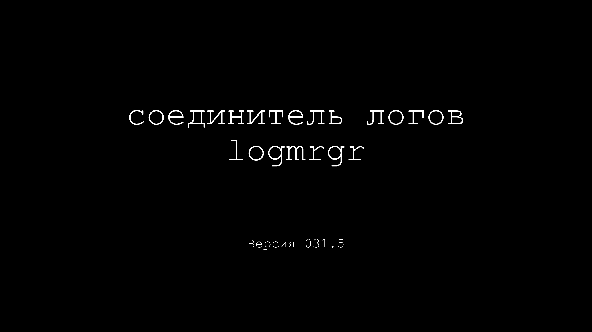
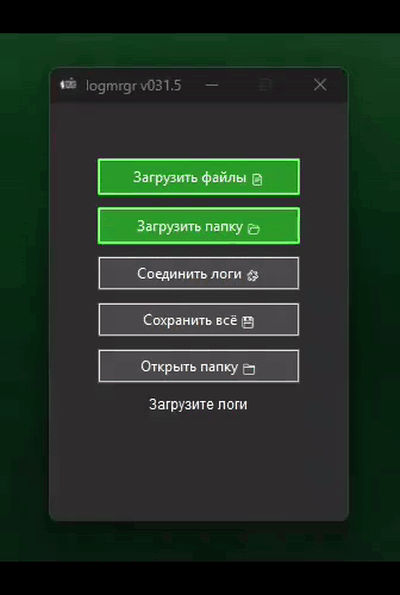

[Презентация](https://github.com/ashtray01/logmrgr/blob/main/logmrgr031.5.pptx) 

[Скачать logmrgr031.6 win64](https://github.com/ashtray01/logmrgr/releases/download/031.6/logmrgr031.6.zip)

 `logmrgr`
 Приложение для объединения лог-файлов по времени событий в них.

`logmrgr` — обрабатывает логи приводя их к одному стандарту. Позволяет работать с файлами любого размера. Используется многопроцессорная обработка и сортировка через `heapq`. Добавлены: корректный прогресс, защита от ошибок в GUI и стабильное сохранение.

## Использование
1. Загрузите `.log`, `.json` файлы, или папку целиком.
2. Соедините логи.
3. Сохраните результат.

## Баги
О всех багах и предложениях пишите сюда:
[logmrgr issues](https://github.com/ashtray01/logmrgr/issues)
